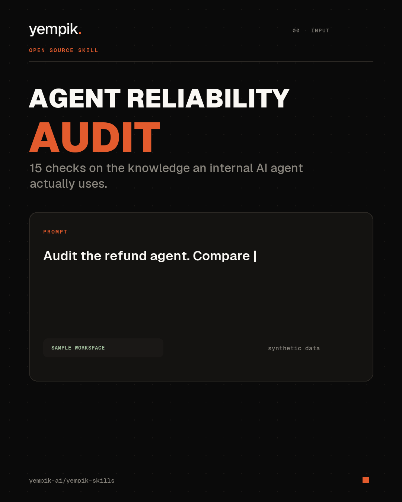

# Agent Reliability Audit

**English first · [Italiano below](#italiano)**

Give Claude one internal AI agent, the policies and procedures it relies on, and recent
traces or cases. The skill runs up to **15 reliability audits** and returns prioritized
findings with reproducible evidence behind every material issue.



## What it catches

An agent can retrieve a plausible document and still take the wrong action. This skill
tests whether the agent's knowledge is:

1. complete enough for the selected workflow;
2. current and clearly versioned;
3. non-conflicting, or governed by an explicit source-precedence rule;
4. approved and attributable to a human owner;
5. cited at the point where a consequential rule is used;
6. permission-aware for the user and action;
7. executable across normal, boundary, conflict, missing-information, and forbidden
   action scenarios.

## The 15 audits

1. Source coverage and silos
2. Tacit knowledge and key-person risk
3. Decision and process coverage
4. Freshness and decay
5. Contradictions
6. Current truth and version control
7. Source lineage and citations
8. Approval and accountability
9. Confidence and inference control
10. Retrieval reliability
11. Executable rules and exceptions
12. Scenario evals and failure handling
13. Permission boundaries and sensitive data
14. Ownership and portability
15. Maintenance and review burden

## Example prompt

```text
Audit our customer-support agent against its instructions, refund policy, handling SOP,
approved decisions, and 20 recent tickets. Find where it could act using stale,
conflicting, unapproved, permission-inappropriate, or untraceable knowledge. Run normal,
boundary, conflict, missing-information, and forbidden-action scenarios.
```

## What it produces

```text
agent-reliability-audit/2026-07-13/
  REPORT.md          # verdict, P0-P3 findings, L0-L4 scope maturity, remediation
  evidence.jsonl     # minimal, reproducible evidence linked to each finding
  evals.md           # scenario test pack and results
  inventory.json     # source inventory when available
```

The skill keeps source systems read-only. It distinguishes direct observation,
inference, and absence testing. A dimension without enough evidence is marked
`NOT ASSESSED`; missing access is never converted into a failing score.

## Reproducible sample

The included [synthetic refund-agent audit](examples/sample-output/REPORT.md) uses five
sources. A current policy requires Finance approval above EUR 500, while an older SOP
still marked active allows Support approval through EUR 1,000. The sample agent selects
the wrong source for a EUR 750 refund.

The audit returns a P1 finding and cites the exact policy, SOP, decision, agent
instruction, and case lines behind it. No customer data is included.

## Modes

1. **Agent:** audit one internal AI agent, its sources, instructions, tools, traces, and
   5-10 scenario evals.
2. **Workflow:** test one business outcome, the acting agent, its rules, exceptions,
   approvals, and recent cases.
3. **Workspace:** assess all 15 dimensions across a company brain or knowledge base,
   using risk-based sampling when the corpus is large.

Start with one agent or workflow. A narrow audit on a real failure surface is stronger
than a shallow organization-wide score.

## Limits

This skill does not certify legal compliance or security, discover knowledge nobody
expressed, prove ROI without operational data, validate the truth of a policy without
an authoritative source, or guarantee future agent behavior. It creates an
evidence-based diagnostic and test surface, not a certification.

## Install

Copy `agent-reliability-audit/` into your Claude skills directory or import
[`agent-reliability-audit.skill`](../agent-reliability-audit.skill) in Cowork.

Built by [Yempik](https://www.yempik.com). The commercial wedge is Agent Reliability;
the broader vision is a governed company brain that the organization owns.

<a name="italiano"></a>

## Italiano

Passa a Claude un agente AI interno, le policy e procedure che usa e alcuni casi o trace
recenti. La skill esegue fino a **15 audit di affidabilità** e restituisce problemi
prioritizzati con una prova riproducibile dietro ogni finding materiale.

### Cosa controlla

Verifica fonti e silos, versione corrente, contraddizioni, citazioni, approvazioni,
permessi, regole ed eccezioni, qualità del recupero delle fonti, gestione delle
inferenze, portabilità, manutenzione e scenari di fallimento.

### Prompt di esempio

```text
Audita il nostro agente di customer support usando istruzioni, policy rimborsi, SOP,
decisioni approvate e 20 ticket recenti. Trova dove potrebbe agire usando conoscenza
vecchia, contraddittoria, non approvata, non consentita o senza fonte. Esegui scenari
normali, limite, conflitto, informazione mancante e azione vietata.
```

La skill lavora in sola lettura e produce `REPORT.md`, `evidence.jsonl`, `evals.md` e
`inventory.json`. Non certifica compliance o sicurezza e non garantisce il comportamento
futuro dell'agente.
