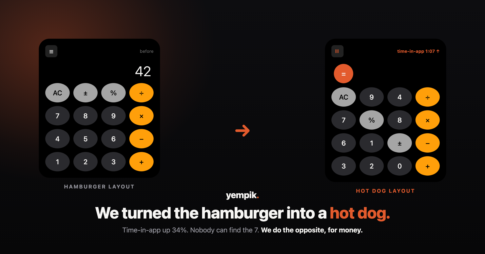

# hotdogify 🌭

> *"We use AI to transform hamburger-style app layouts into hot dog-style layouts."*

A skill that makes a UI **confidently worse** — and writes the straight-faced report that calls
every regression a win. The bit is borrowed from a satire email making the rounds; the craft is
ours. The math still works. That was never the problem.



> **Hero image:** drop the screenshot you want here as `assets/hero.png` (the original "hot dog
> layout" email works), **or** open `assets/hero.html` in a browser and screenshot it for a
> yempik-branded before → after cover.

**🇮🇹 [Italiano](#italiano) · 🇬🇧 [English](#english)**

---

<a name="italiano"></a>
## 🇮🇹 Italiano

"Taste is the moat", dicono. Questa skill è cosa succede quando ottimizzi un prodotto con zero
taste e fiducia infinita: peggiora un'interfaccia **davvero**, poi scrive il memo che chiama ogni
peggioramento un *win* — serissimo, pieno di metriche, finanziabile.

L'output è fatto per essere **pubblicato**. Funziona perché l'artefatto è reale: la UI si
trasforma sul serio, il report sembra una slide che hai già visto. La comicità sta nella distanza
tra cosa è cambiato (è peggiorato) e come viene descritto ("intentional friction").

### Due modalità

| Modalità | Quando | Cosa produce |
|---|---|---|
| **A — Transform** | Hai HTML/CSS, un componente o uno screenshot | La versione "hotdogata" reale + il **Hot Dog Report** deadpan |
| **B — Memo** | Vuoi solo il testo | La mail in stile "Frank" e/o il post LinkedIn |

### Le mosse (la Hot Dog Doctrine)

1. **Ruota l'hamburger** ☰ di 90° → diventa un hot dog.
2. **Scorrela posizione e valore** — il tastierino mescolato (il `7` dov'è capitato).
3. **Sposta l'azione primaria** — la CTA lontano da dove cade l'occhio.
4. **Inverti due vicini** — scambia due etichette adiacenti.
5. **Monta un vanity meter** — un contatore "time-in-app" che sale e basta.

Peggiore, non rotto. Deadpan, non chiassoso. Il bersaglio è il *teatro* dell'ottimizzazione e le
frasi fatte ("taste is the moat", "intentional friction", "number go up") — **mai** persone o
aziende reali.

### Come si usa

1. Copia la cartella `hotdogify/` nelle skill del tuo Claude (in Claude Code: `.claude/skills/`).
2. Dì *"hotdogify questa UI"* e passagli un file/uno screenshot — oppure *"scrivimi un Frank memo
   su X"* per la sola modalità B.
3. Niente in mano? La skill "hotdoga" `assets/sample-ui.html`, così c'è sempre una demo.

Guarda `examples/` per un before → after completo (calcolatrice), il report e il post pronti.

---

<a name="english"></a>
## 🇬🇧 English

Someone said "taste is the moat." This skill is what happens when you optimize a product with zero
taste and infinite confidence: it makes a real interface **measurably worse**, then writes the memo
that calls every regression a *win* — straight-faced, metric-laden, fundable.

The output is meant to be **posted**. It works because the artifact is real: the UI actually
transforms, the report actually reads like a deck you've seen. The comedy is in the gap between
what changed (it got worse) and how it's described ("intentional friction").

### Two modes

| Mode | When | What you get |
|---|---|---|
| **A — Transform** | You have HTML/CSS, a component, or a screenshot | The genuinely "hotdogified" version + the deadpan **Hot Dog Report** |
| **B — Memo only** | You just want the copy | The Frank-style email and/or the LinkedIn post |

### The moves (the Hot Dog Doctrine)

1. **Rotate the hamburger** ☰ 90° → it's a hot dog.
2. **Decorrelate position from value** — the keypad shuffled (the `7` wherever it landed).
3. **Relocate the primary action** — the CTA off where the eye lands.
4. **Transpose two neighbours** — swap two adjacent labels.
5. **Mount a vanity meter** — a "time-in-app" counter that only goes up.

Worse, not broken. Deadpan, not loud. The target is the *theater* of optimization and the
platitudes ("taste is the moat", "intentional friction", "number go up") — **never** a real person
or company.

### How to use it

1. Copy the `hotdogify/` folder into your Claude skills (in Claude Code: `.claude/skills/`).
2. Say *"hotdogify this UI"* and hand it a file/screenshot — or *"write me a Frank memo about X"*
   for Mode B only.
3. Nothing in hand? The skill hotdogifies `assets/sample-ui.html`, so there's always a demo.

See `examples/` for a full before → after (a calculator), the report, and the post.

---

## What's in the box

```
hotdogify/
├── SKILL.md                          # the skill — Claude reads it itself
├── README.md                         # this file
├── assets/
│   ├── sample-ui.html                # the "hamburger" baseline (a sensible calculator)
│   └── hero.html                     # yempik-branded before → after cover (screenshot it)
└── examples/
    ├── hotdogified-calculator.html   # the AFTER — open it next to sample-ui.html
    ├── hot-dog-report.md             # the deadpan memo
    └── linkedin-post.md              # the post to caption the before → after
```

---

*Maintained by **yempik.** — in production, not in slides.*
