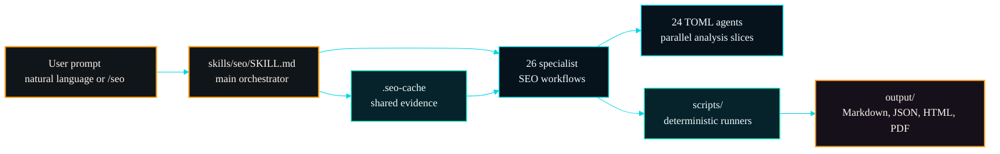
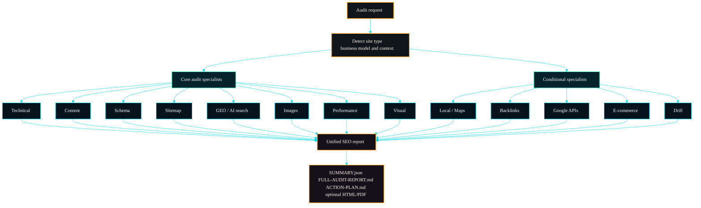
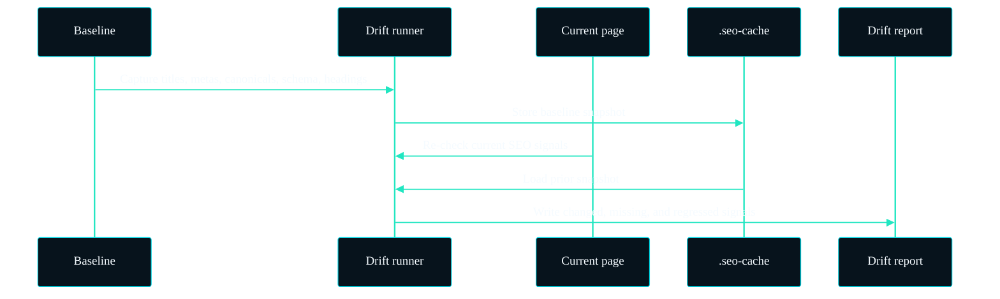
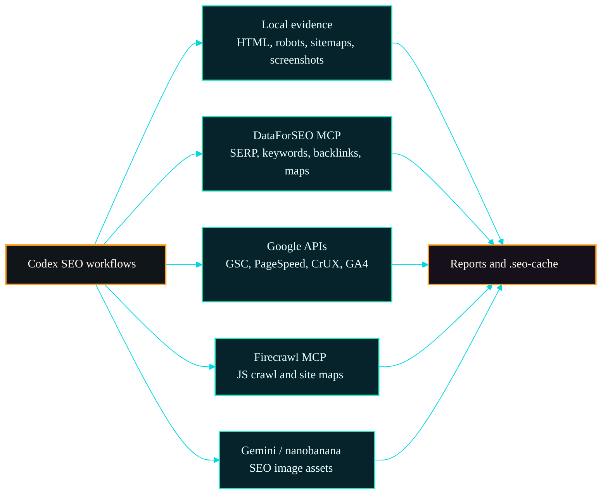
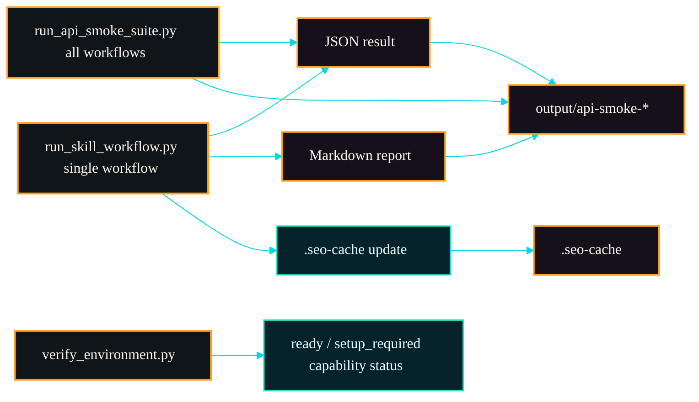
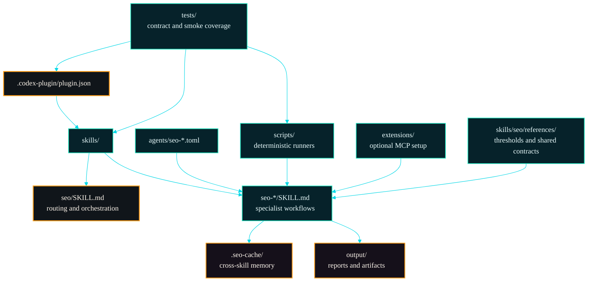

<p align="center">
  
</p>

# Codex SEO - SEO Audit Skill Suite for Codex

Codex-first SEO analysis suite with 1 orchestrator skill, 26 specialist workflows, 24 TOML agent profiles, MCP/API extensions, deterministic headless runners, and premium audit report generation.

[](https://github.com/AgriciDaniel/codex-seo/actions/workflows/runners-ci.yml)
[](https://github.com/AgriciDaniel/codex-seo/releases)
[](https://github.com/openai/codex)
[](LICENSE)
[](pyproject.toml)
[](docs/COMMANDS.md)

Codex SEO is a Codex-native port of [`AgriciDaniel/claude-seo`](https://github.com/AgriciDaniel/claude-seo), synchronized to upstream `main` at `a9cf338` and adapted for Codex skills, Codex plugins, TOML agents, shared cache artifacts, and repeatable local/API execution.

It covers technical SEO, on-page analysis, content quality, E-E-A-T, schema markup, image optimization, sitemap architecture, Core Web Vitals, GEO/AEO for AI search, backlinks, local SEO, maps intelligence, Google APIs, semantic clustering, SXO, drift monitoring, e-commerce SEO, hreflang, FLOW prompts, DataForSEO, Firecrawl, and Gemini/nanobanana image workflows.

## Contents

- [Status](#status)
- [Install](#install)
- [Quick Start](#quick-start)
- [Visual Overview](#visual-overview)
- [Commands](#commands)
- [Features](#features)
- [Extensions](#extensions)
- [Headless/API Usage](#headlessapi-usage)
- [Architecture](#architecture)
- [Verification](#verification)
- [Requirements](#requirements)
- [Credentials And Cache](#credentials-and-cache)
- [Security](#security)
- [Uninstall](#uninstall)
- [Contributing](#contributing)
- [Related Projects](#related-projects)
- [Credits](#credits)
- [Attribution](#attribution)

## Status

- Repository visibility: public.
- Current release: [`v1.9.6-codex.5`](https://github.com/AgriciDaniel/codex-seo/releases/tag/v1.9.6-codex.5).
- Installer default ref: `v1.9.6-codex.5`.
- Latest local validation: 52 tests passing, full installed smoke suite passing, demo readiness passing.
- Runtime credentials stay outside the repo under Codex/local config paths.
- Discovery topics: `codex`, `codex-cli`, `codex-skills`, `seo`, `ai-seo`, `ai-search`, `technical-seo`, `generative-engine-optimization`, `core-web-vitals`, `schema-markup`, `local-seo`, `ecommerce-seo`, `content-strategy`, `google-search-console`, `dataforseo`, `mcp`, `python`, `automation`, `marketing-automation`, `open-source`.

## Install

### One-Line Install

```bash
curl -fsSL https://raw.githubusercontent.com/AgriciDaniel/codex-seo/v1.9.6-codex.5/install.sh | bash
```

Windows:

```powershell
irm https://raw.githubusercontent.com/AgriciDaniel/codex-seo/v1.9.6-codex.5/install.ps1 | iex
```

### Review Before Installing

```bash
git clone https://github.com/AgriciDaniel/codex-seo.git
cd codex-seo
bash install.sh
```

Windows:

```powershell
git clone https://github.com/AgriciDaniel/codex-seo.git
cd codex-seo
powershell -ExecutionPolicy Bypass -File .\install.ps1
```

The installer copies the skill suite into `~/.codex/skills/`, installs TOML agents into `~/.codex/agents/`, creates a Python virtualenv at `~/.codex/skills/seo/.venv/`, installs core runtime dependencies, attempts optional capability groups, and verifies the runtime.

### Installer Overrides

```bash
CODEX_HOME=~/.codex \
CODEX_SEO_REPO=https://github.com/AgriciDaniel/codex-seo \
CODEX_SEO_REF=v1.9.6-codex.5 \
bash install.sh
```

| Variable | Purpose |
|---|---|
| `CODEX_HOME` | Alternate Codex home. Defaults to `~/.codex`. |
| `CODEX_SEO_REPO` | Git URL, fork URL, or local repository path. |
| `CODEX_SEO_REF` | Branch, tag, or commit. Defaults to `v1.9.6-codex.5`. |
| `CODEX_SEO_SKIP_PLAYWRIGHT_BROWSER=1` | Skip Chromium install for visual/PDF workflows. |
| `CODEX_SEO_PLAYWRIGHT_WITH_DEPS=1` | Ask Playwright to install system dependencies where supported. |

## Quick Start

Restart Codex after installation. Then ask naturally; a `/seo` command is not required:

```text
Do a full SEO check on https://example.com following best practices.
```

```text
Review this page for schema, Core Web Vitals, image SEO, and AI search readiness.
```

```text
Create an SEO strategy and content roadmap for a local dental clinic.
```

Command-style prompts also work:

```text
/seo audit https://example.com
/seo technical https://example.com
/seo schema https://example.com
/seo dataforseo serp "best seo tools"
```

## Visual Overview

Codex SEO is designed as a Codex-first routing layer: the user can ask naturally, the orchestrator selects the right specialist workflow, and deterministic runners write repeatable artifacts instead of relying on invisible chat-only output.



## Commands

| Prompt | Purpose |
|---|---|
| `/seo audit <url>` | Full site audit with specialist routing and premium report support |
| `/seo page <url>` | Deep single-page SEO analysis |
| `/seo technical <url>` | Crawlability, indexability, security, JavaScript, CWV |
| `/seo content <url>` | E-E-A-T, helpfulness, readability, AI citation readiness |
| `/seo schema <url>` | Structured data detection, validation, and JSON-LD generation |
| `/seo images <url>` | Alt text, image weight, formats, metadata, image SERP opportunities |
| `/seo sitemap <url>` | XML sitemap discovery, quality gates, generation guidance |
| `/seo geo <url>` | AI Overviews, ChatGPT, Perplexity, llms.txt, citability |
| `/seo performance <url>` | Core Web Vitals, Lighthouse-oriented performance signals |
| `/seo visual <url>` | Screenshots, mobile rendering, above-the-fold analysis |
| `/seo plan <business-type>` | Strategic SEO roadmap and content plan |
| `/seo programmatic <url>` | Programmatic SEO risk and scale planning |
| `/seo competitor-pages <url>` | Comparison and alternatives page opportunities |
| `/seo hreflang <url>` | International SEO, locale validation, content parity |
| `/seo local <url>` | Local SEO, GBP signals, NAP, citations, reviews |
| `/seo maps <command>` | Geo-grid, GBP audit, review intelligence, local maps signals |
| `/seo google <command>` | GSC, PageSpeed, CrUX, Indexing API, GA4 workflows |
| `/seo backlinks <url>` | Backlink profile summary and source-tier detection |
| `/seo cluster <keyword>` | SERP-based topic clustering and hub-spoke planning |
| `/seo sxo <url>` | Search Experience Optimization, intent/page-type fit |
| `/seo drift baseline <url>` | Capture an SEO baseline before changes |
| `/seo drift compare <url>` | Compare current SEO signals against a baseline |
| `/seo ecommerce <url>` | Product SEO, marketplace visibility, product schema |
| `/seo flow <stage>` | FLOW framework prompts for Find, Leverage, Optimize, Win |
| `/seo dataforseo <command>` | Live SERP, keyword, backlink, content, and AI visibility data |
| `/seo firecrawl <command>` | JS-rendered crawling and site mapping via Firecrawl |
| `/seo image-gen <use-case>` | OG images, hero images, product visuals, infographics |

Full command details live in [docs/COMMANDS.md](docs/COMMANDS.md).

## Features

### Full Audit Pipeline

- Detects site/business type.
- Runs technical, content, schema, sitemap, performance, visual, GEO, image, and on-page analysis.
- Adds conditional specialists for local, maps, Google APIs, backlinks, clusters, SXO, drift, and e-commerce.
- Writes markdown reports, JSON summaries, cache artifacts, and optional premium HTML/PDF output.



### Technical SEO

- Robots.txt, sitemap discovery, canonical checks, indexability, URL hygiene.
- Security headers, JavaScript rendering risk, mobile basics, IndexNow.
- Core Web Vitals with INP, LCP, CLS, FCP, TTFB, and PageSpeed/CrUX integrations where available.

### Content, GEO, And SXO

- E-E-A-T and helpful content signals.
- AI citation readiness, answer-first formatting, entity clarity, llms.txt support.
- Search experience analysis: page type, user stories, persona fit, intent mismatch.

### Structured Data

- JSON-LD extraction and validation.
- Schema recommendations for Organization, LocalBusiness, Product, Article, FAQ, Breadcrumb, and related types.
- Generated schema artifacts for downstream use.

### Local, Maps, And E-Commerce SEO

- Local SEO signals, GBP readiness, citations, reviews, NAP consistency.
- Maps intelligence via free sources and DataForSEO when configured.
- Product schema, marketplace endpoints, merchant visibility, and e-commerce template checks.

### Drift Monitoring

- Capture SEO-critical baselines.
- Compare deployments or page changes.
- Track title, meta, headings, canonical, schema, robots, links, and content deltas.



### Deterministic Runners

- `scripts/run_skill_workflow.py` standardizes output for every user-invokable workflow.
- `scripts/run_api_smoke_suite.py` runs all supported workflows in one pass.
- Setup-required workflows return structured fallback results instead of pretending live data exists.

## Extensions

| Extension | Skill | Setup | Notes |
|---|---|---|---|
| DataForSEO | `seo-dataforseo`, `seo-maps`, `seo-ecommerce`, `seo-cluster` | `./extensions/dataforseo/install.sh` | Live SERP, keyword, backlinks, on-page, content, business data, AI visibility |
| Google APIs | `seo-google`, `seo-performance` | `python scripts/google_auth.py --setup` | PageSpeed, CrUX, GSC, URL Inspection, Indexing API, GA4 |
| Firecrawl | `seo-firecrawl` | `./extensions/firecrawl/install.sh` | JS-rendered crawl, scrape, site map |
| Banana / Gemini | `seo-image-gen` | `./extensions/banana/install.sh` | AI image generation through `nanobanana-mcp` |

Optional integrations enrich the same workflow surface. If credentials or MCP servers are missing, wrappers return `setup_required` or `mcp_configured` states with no fabricated live data.



Demo readiness:

```bash
python scripts/demo_readiness.py --target https://example.com --live-apis --workflows --json
```

One low-depth DataForSEO proof:

```bash
python scripts/demo_readiness.py --target https://example.com --live-apis --live-serp --serp-keyword "seo tools" --json
```

## Headless/API Usage

Run a single workflow:

```bash
python scripts/run_skill_workflow.py --skill seo-technical https://example.com --json
python scripts/run_skill_workflow.py --skill seo-google https://example.com --json
python scripts/run_skill_workflow.py --skill seo-dataforseo https://example.com --json
```

Run the full smoke suite:

```bash
python scripts/run_api_smoke_suite.py https://example.com --json
```

Verify environment:

```bash
python scripts/verify_environment.py --target https://example.com --json
```

Bootstrap a clean runtime:

```bash
python scripts/bootstrap_environment.py --venv .venv --json
```

Artifacts are written to `output/`. Shared project cache is written to `.seo-cache/`. Both are ignored by git.



## Architecture

The repository separates Codex-facing instructions, deterministic runtime code, optional provider setup, and validation contracts. That keeps the skill system usable in chat, installable as a suite, and testable from CI/API workflows.



```text
codex-seo/
├── .codex-plugin/plugin.json        # Codex plugin manifest
├── skills/
│   ├── seo/SKILL.md                 # Main orchestrator
│   └── seo-*/SKILL.md               # 26 specialist workflows
├── agents/                          # 24 Codex TOML agent profiles
├── scripts/                         # Deterministic runners and API helpers
├── extensions/
│   ├── dataforseo/                  # DataForSEO MCP setup and docs
│   ├── firecrawl/                   # Firecrawl MCP setup and docs
│   └── banana/                      # Gemini/nanobanana image generation setup
├── hooks/                           # Quality-gate hooks
├── schema/                          # Schema.org templates
├── docs/                            # Architecture, commands, installation, MCP, demo
└── tests/                           # Contract and workflow tests
```

Design principles:

- `skills/` is the source of truth.
- `skills/seo/SKILL.md` routes natural-language SEO requests.
- TOML agents are Codex-native and mirror specialist workflows.
- Runtime credentials stay in `~/.config/codex-seo/` or `~/.codex/settings.json`.
- Legacy `claude-seo` config/cache paths are read only as migration fallback.

More detail: [docs/ARCHITECTURE.md](docs/ARCHITECTURE.md).

## Verification

Local release gate:

```bash
python -m pytest tests/
bash -n install.sh uninstall.sh
python -m compileall -q scripts hooks
python scripts/run_api_smoke_suite.py https://example.com --json
```

PowerShell parse check:

```powershell
$files = Get-ChildItem -Recurse -Filter *.ps1
foreach ($f in $files) {
  $tokens = $null
  $errs = $null
  [System.Management.Automation.Language.Parser]::ParseFile($f.FullName, [ref]$tokens, [ref]$errs) > $null
  if ($errs.Count) { $errs; exit 1 }
}
```

Current GitHub CI runs:

- dependency install
- shell syntax checks
- Python compile checks
- `--help` checks for runner scripts
- `python -m pytest tests/`
- contract smoke checks for MCP-aware workflows

## Requirements

- Codex CLI with local skills support
- Python 3.10+
- Git
- Optional: Playwright Chromium for screenshots and PDF reports
- Optional: DataForSEO account for live SEO data
- Optional: Google API credentials for PageSpeed/CrUX/GSC/GA4
- Optional: Firecrawl API key for JS-rendered crawling
- Optional: Google AI API key for Gemini/nanobanana image generation

## Credentials And Cache

Codex SEO writes new local credentials and state to Codex-specific paths:

- `~/.codex/settings.json` for MCP server configuration
- `~/.config/codex-seo/` for API configs and cost ledgers
- `~/.cache/codex-seo/` for runtime caches
- `.seo-cache/` inside the active project for cross-skill summaries

Legacy `~/.config/claude-seo/` and `~/.cache/claude-seo/` paths are read only as migration fallback. Do not commit `.seo-cache/`, `output/`, `.mcp.json`, `.env`, OAuth tokens, service accounts, or provider keys.

## Security

- URL-aware scripts block private, loopback, reserved, multicast, unspecified, and metadata hosts.
- Credential setup writes outside tracked repo files.
- Sensitive local settings are expected to use `0600` file permissions.
- DataForSEO calls use cost guardrails through `scripts/dataforseo_costs.py`.
- Report vulnerabilities through [SECURITY.md](SECURITY.md).

## Uninstall

```bash
bash uninstall.sh
```

Windows:

```powershell
powershell -ExecutionPolicy Bypass -File .\uninstall.ps1
```

## Contributing

Use [CONTRIBUTING.md](CONTRIBUTING.md) for local setup and validation, [CODE_OF_CONDUCT.md](CODE_OF_CONDUCT.md) for project standards, [SECURITY.md](SECURITY.md) for vulnerability reporting, and [CREDITS.md](CREDITS.md) for project credits. Agent-facing project context is also available in [llms.txt](llms.txt).

## Related Projects

- [`claude-seo`](https://github.com/AgriciDaniel/claude-seo) - original Claude Code SEO skill suite
- [`claude-blog`](https://github.com/AgriciDaniel/claude-blog) - blog creation and optimization skill ecosystem
- [`claude-ads`](https://github.com/AgriciDaniel/claude-ads) - paid advertising audit skill suite
- [`flow`](https://github.com/AgriciDaniel/flow) - evidence-led SEO framework for AI search
- [`wp-mcp-ultimate`](https://github.com/AgriciDaniel/wp-mcp-ultimate) - WordPress MCP server

## Credits

Special thanks to [avalonreset](https://github.com/avalonreset) for making the Codex conversion possible and for creating the initial Codex SEO version that this repository builds on.

## Attribution

Original project and concept by [AgriciDaniel](https://github.com/AgriciDaniel) in [`claude-seo`](https://github.com/AgriciDaniel/claude-seo). This Codex port preserves upstream SEO capabilities and adapts the runtime for Codex skills, TOML agents, plugin discovery, cache sharing, MCP extension setup, and API-safe wrappers.

Codex SEO is released under the MIT License. FLOW prompt references retain their upstream attribution and licensing notices where included.
